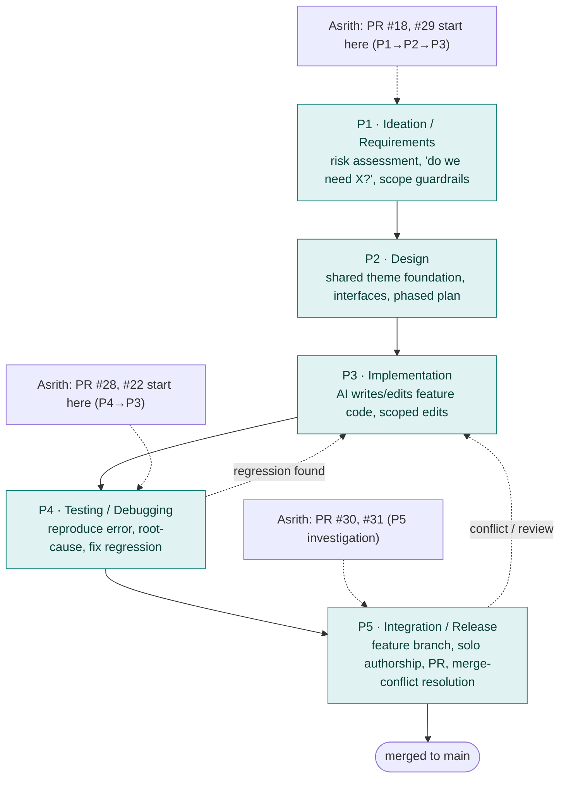

# CostSense-Forecast — AIPDLC Documentation

**AIPDLC = AI-Powered Development Life Cycle**

This document records how the CostSense-Forecast team used AI (Cursor + Amazon Bedrock coding assistance) across every phase of the development life cycle. It captures the intent, the AI action taken, the files touched, and the outcome for each meaningful AI interaction, so the work is auditable and reproducible.

## How this document is filled

Each contributor owns their own section and fills only their own AI-assisted work.

This copy has **Roopitha S** (rs-dil), **Asrith** (asrithdili), and **Adhvyth** (dil-adhvyth) sections completed.

---

## 1. Project Snapshot

| Field | Value |
|---|---|
| **Project** | CostSense-Forecast — AWS FinOps forecasting + cost-anomaly + PR-cost-prediction dashboard |
| **Stack** | Python 3.12, Streamlit, boto3 (AWS Cost Explorer / CloudWatch), Amazon Bedrock, LightGBM, Plotly |
| **AI tooling** | Cursor (agent + inline), Amazon Bedrock LLM (in-app agent), Claude Code (CLI) |
| **Repo layout** | `src/` (aws, ai_agent, pr_scanner, forecast, backtest, pipeline, ci, dashboard), `docs/`, `.github/workflows/` |
| **Primary surfaces** | Streamlit multi-page app: Dashboard, PR Predictor, Anomalies, Org Level Impact, Future Forecast, Ask CostSense (chat) |

---

## 2. Contribution Ownership (high level)

| Contributor | Git identity | Primary AI-assisted areas |
|---|---|---|
| **Roopitha S** | Roopitha S / rs-dil / RS-dil | AWS profile resolution fix, GitHub repo access for the chat agent, PR Predictor UI/logic, shared UX design system + per-page UX migration, sidebar layout, Live Cost Impact Meter, notifications MVP + SMTP email send, Streamlit chrome hardening, merge-conflict resolution |
| **Asrith** | Asrith Tumpudi / asrithdili | Regime-shift forecast + top-nav, PR Predictor historical-precedent grounding, shared tile grid + meta_row UX helper, Dashboard PR-layer status banner, Org-Level Impact v2 (projection-led, ownership-aware), Future Forecast persistent state, deep-link repo-carryover fix, Ask CostSense hallucination hardening + Future Forecast rewrite, App Runner + public ECR deploy investigation, Streamlit Community Cloud deploy path, ECS + ALB cross-account multi-account deploy (WebSocket-compatible) |
| **Adhvyth** | Adhvyth Thogaru / dil-adhvyth | AWS auth/session factory, forecast engine (LightGBM ensemble), anomaly→draft-PR automation, PR cost-check CI workflow, Future Forecast event backend, ECS deployment pipeline |

---

## 2A. PR Contribution Map (Diagram)

Who contributed which PR, what it covers, and the AIPDLC phases each PR exercised.

**Detailed AIPDLC narrative is authoritative for every contributor's own section.** Section 4 covers Roopitha's PRs; Section 5 covers Asrith's; Section 6 covers Adhvyth's.

```mermaid
flowchart LR
    MAIN(["main branch"])

    subgraph RS["Roopitha S — rs-dil  (COMPLETE)"]
        direction TB
        PR1["PR #1 · AWS profile fix<br/>+ GitHub repo access for chat agent<br/><b>P3 · P4</b>"]
        PR2["PR #2 · PR Predictor UI<br/>+ gh CLI path fix / $ LaTeX fix<br/><b>P3 · P4</b>"]
        PR4["PR #4 · Hide Streamlit Deploy button<br/><b>P1 · P3</b>"]
        PR13["PR #13 · Shared UX design system<br/>+ per-page migration (all 5 pages)<br/><b>P2 · P3</b>"]
        PR17["PR #17 · Notification drafts<br/>+ manual SMTP email send<br/><b>P1 · P3 · P5</b>"]
        PR19["PR #19 · Anomalies continuous<br/>analysis scheduling + auto re-run<br/><b>P3 · P4</b>"]
    end

    subgraph AS["Asrith — asrithdili  (COMPLETE)"]
        direction TB
        PR3["PR #3 · Anomalies approaches +<br/>org top-N + dashboard consistency<br/><b>P3 · P4</b>"]
        PR5["PR #5 · Regime-shift forecast + top nav<br/><b>P2 · P3</b>"]
        PR6["PR #6 · Docs: regime detector + accuracy<br/><b>P2</b>"]
        PR7["PR #7 · Top-bar brand + controls<br/><b>P2 · P3</b>"]
        PR10["PR #10 · PR Predictor precedent grounding<br/><b>P2 · P3 · P4</b>"]
        PR15["PR #15 · UI polish: tile grid + meta_row<br/><b>P3</b>"]
        PR16["PR #16 · Dashboard PR-status banner<br/><b>P2 · P3</b>"]
        PR18["PR #18 · Org-Level Impact v2 (projection-led)<br/><b>P1 · P2 · P3</b>"]
        PR21["PR #21 · Org Impact daily-spend chart polish<br/><b>P3</b>"]
        PR22["PR #22 · Future Forecast: persist view state<br/><b>P3 · P4</b>"]
        PR28["PR #28 · Fix Anomalies deep-link repo carryover<br/><b>P4</b>"]
        PR29["PR #29 · Harden Ask CostSense + Future Forecast<br/><b>P1 · P3 · P4</b>"]
        PR30["PR #30 · Deploy to App Runner (public ECR) [open]<br/><b>P5</b>"]
        PR31["PR #31 · Deploy to Streamlit Cloud [open]<br/><b>P4 · P5</b>"]
    end

    subgraph AD["Adhvyth — dil-adhvyth  (COMPLETE)"]
        direction TB
        PR9["PR #9 · AWS login + forecast details"]
        PR12["PR #12 · Draft PRs from anomaly recs"]
        PR14["PR #14 · GitHub workflow for cost check"]
        PR20["PR #20 · Future Forecast page + events on baseline"]
        PR23["PR #23 · Baseline + explicit future events"]
        PR24_27["PR #24–#27 · Deployment pipeline + Docker"]
    end


    classDef rs fill:#0C7C74,stroke:#0a5d57,color:#fff;
    classDef as fill:#2563eb,stroke:#1e40af,color:#fff;
    classDef ad fill:#b45309,stroke:#7c3f06,color:#fff;
    classDef main fill:#111827,stroke:#000,color:#fff;
    class PR1,PR2,PR4,PR13,PR17,PR19 rs;
    class PR3,PR5,PR6,PR7,PR10,PR15,PR16,PR18,PR21,PR22,PR28,PR29,PR30,PR31 as;
    class PR9,PR12,PR14,PR20,PR23,PR24_27 ad;
    class MAIN main;
```

### PR → Contribution → AIPDLC coverage

| PR | Author | Branch | What it covers | AIPDLC phases | Status |
|---|---|---|---|---|---|
| #1 | Roopitha S | fix/github-access-and-chat-improvements | AWS profile crash fix; GitHub repo access layer + read-only tools for chat agent | P3, P4 | Merged |
| #2 | Roopitha S | fix/pr-predictor-ui-and-gh-path | PR Predictor UI (pros/cons, code diff); gh CLI Windows path; `$` LaTeX fix | P3, P4 | Merged |
| #4 | Roopitha S | hide-deploy-button | Hide Streamlit Deploy button (toolbarMode=viewer) | P1, P3 | Merged |
| #13 | Roopitha S | ux-improvement | Shared costsense_theme design system + migrate all 5 pages; sidebar; Live Cost Meter | P2, P3 | Merged |
| #17 | Roopitha S | notification-email | Manual notification drafts + SMTP email send on key pages | P1, P3, P5 | Merged |
| #19 | Roopitha S | feature/anomalies-continuous-analysis | Anomalies continuous-analysis scheduling: toggle + frequency-based auto re-run, live countdown, session persistence, interrupted-scan guards | P3, P4 | Merged |
| #3 | Asrith | fix/code-changes-in-dashboard-and-other-tabs | Anomalies approaches selection UI, org-level top-N filtering, dashboard cross-tab consistency fixes | P3, P4 | Merged |
| #5 | Asrith | feature/regime-forecast-and-top-nav | Regime-shift forecast detector + top nav layout | P2, P3 | Merged |
| #6 | Asrith | docs/regime-forecast-and-top-nav-updates | Docs: regime detector rationale + top-bar UI + backtest accuracy numbers | P2 | Merged |
| #7 | Asrith | ui/top-bar-brand-and-controls | Top-bar brand card + shared controls container | P2, P3 | Merged |
| #10 | Asrith | pr-predictor-precedent-tool | PR Predictor grounded in historical precedent (LLM-invoked `precedent_lookup` tool) | P2, P3, P4 | Merged |
| #15 | Asrith | ui-tile-polish | UI polish: shared tile grid + meta_row helper | P3 | Merged |
| #16 | Asrith | dashboard-pr-status-banner | Dashboard PR-layer status banner (merged / open / expected Δ) | P2, P3 | Merged |
| #18 | Asrith | org-impact-v2 | Org-Level Impact v2: projection-led, ownership-aware, dollar-ranked movers | P1, P2, P3 | Merged |
| #21 | Asrith | org-impact-trend-polish | Org Impact: polish the daily-spend trend chart | P3 | Merged |
| #22 | Asrith | future-forecast-persist | Future Forecast: persist view state to disk (per-profile disk-backed cache) | P3, P4 | Merged |
| #28 | Asrith | fix-anomalies-deeplink-repo-carryover | Fix Anomalies deep-link carrying over unrelated repos into an account-only scan | P4 | Merged |
| #29 | Asrith | harden-no-hallucination-chat | Harden Ask CostSense (no hallucinated $), tab-substitution guard, rebuild Future Forecast as pure aggregator, event-prediction chart contract | P1, P3, P4 | Merged |
| #30 | Asrith | deploy-apprunner-public-ecr | Deploy CostSense to App Runner via public ECR (SCP-safe pattern); investigation of WebSocket blocker | P5 | Open |
| #31 | Asrith | deploy-streamlit-cloud | Deploy CostSense to Streamlit Community Cloud (alternative to App Runner) | P4, P5 | Open |
| #9 | Adhvyth | aws-login-and-forecast-details-updated | AWS login + forecast detail updates (§6.1) | P2, P3 | Merged |
| #12 | Adhvyth | Create-draft-PRS-from-anomaly-recomendations | Draft PR creation from anomaly recommendations (§6.2) | P3 | Merged |
| #14 | Adhvyth | Github-workflow-for-cost-check | GitHub Actions workflow for PR cost check (§6.3) | P3, P5 | Merged |
| #20 | Adhvyth | baseline-and-explicit-future-events | Future Forecast page + future events on baseline (§6.4) | P2, P3, P4 | Merged |
| #23 | Adhvyth | baseline-and-explicit-future-events | Baseline + explicit future-event fixes (§6.4) | P4 | Merged |
| #24–#27 | Adhvyth | deployment-pipeline | ECS deployment pipeline + Dockerfile + CFN (§6.5) | P5 | Merged |

### How the team applied AIPDLC (per-phase flow)

**Reading the flow**: every CostSense PR moved through the same loop — an AI-assisted framing/design step, AI-driven implementation, an AI debugging loop when something broke (dashed arrow back to P3), and an AI-guided release step (branch → solo-authored commit → PR → conflict resolution). Asrith's PRs entered the loop at different phases: e.g. the "no hallucinations" PR #29 started at P1 (a user complaint reframed as a system-design requirement), the deploy PRs #30/#31 lived entirely in P4/P5 (root-cause + release-engineering), and Org-Level Impact v2 (#18) spanned P1→P3 (product-shape decision + implementation).

---

## 3. AIPDLC Phase Legend

The logs below are tagged with the life-cycle phase they belong to:

- **P1** – Ideation / Requirements — clarifying scope, deciding whether to build something, risk assessment.
- **P2** – Design — architecture/UX decisions, shared foundations, interfaces.
- **P3** – Implementation — writing/modifying feature code with AI.
- **P4** – Testing / Debugging — reproducing errors, root-causing, fixing regressions.
- **P5** – Integration / Release — branching, commits, PRs, merge-conflict resolution, environment setup.

---

## 4. Contribution Log — Roopitha S (rs-dil)  ✅ COMPLETE

Ordered roughly chronologically. Each entry = one AI-assisted unit of work.

### 4.1 Environment bring-up & app run

- **Phase:** P5 – Integration / Release
- **Intent:** "Give commands to run this app"; later set up a clean venv and run Streamlit on Windows.
- **AI action:** Produced the exact PowerShell steps to create/activate `.venv`, install `requirements.txt`, and launch `streamlit run src/dashboard/app.py`.
- **Outcome:** App running locally; repeatable startup flow established for the rest of the work.

### 4.2 Fix: AWS profile resolution crash

- **Phase:** P4 – Testing / Debugging
- **Intent:** App crashed with `botocore.exceptions.ProfileNotFound: The config profile (dil-team-hackfest) could not be found` on the Dashboard page.
- **AI action:** Root-caused to `resolve_all()` → `list_profiles()`; hardened `src/aws/profiles.py` so it no longer crashes when `AWS_PROFILE` points at a nonexistent profile, and degrades gracefully when no profiles are reachable.
- **Files:** `src/aws/profiles.py`
- **Outcome:** Dashboard loads even with a missing/invalid AWS profile instead of hard-crashing.

### 4.3 Feature: GitHub repo access for the "Ask CostSense" chat agent

- **Phase:** P3 – Implementation
- **Intent:** The in-app agent replied *"I don't have access to GitHub repositories"*; user wanted it to directly fetch and reason over a GitHub repo when asked.
- **AI action:**
  - New GitHub access layer `src/pr_scanner/gh_client.py` — `gh` CLI with REST API fallback: repo search (org-scoped then global), directory listing, file reads, code search, PR listing.
  - New read-only GitHub tools `src/ai_agent/github_tools.py` exposed to the chat agent.
  - `src/ai_agent/chat_agent.py` — registered the GitHub tools; updated system prompt to grant GitHub access and require `$` on dollar figures.
  - `src/ai_agent/agent.py` — PR diff fetch now uses the shared `gh_client` (fixes `WinError 2` when `gh` CLI isn't installed).
  - `src/dashboard/app.py` — show GitHub tools in sidebar, echo user message + spinner while the agent works, removed the tool-call-count expander.
- **Files:** `src/pr_scanner/gh_client.py`, `src/ai_agent/github_tools.py`, `src/ai_agent/chat_agent.py`, `src/ai_agent/agent.py`, `src/dashboard/app.py`, `src/aws/profiles.py`
- **Commit:** `68c598b`
- **Outcome:** Chat agent can fetch and analyze GitHub repos end-to-end with a CLI/REST fallback.

### 4.4 Fix + polish: PR Predictor UI and gh CLI path

- **Phase:** P3 – Implementation / P4 – Debugging
- **Intent:** Improve PR Predictor readability; fix false 404s on private repos; stop dollar amounts rendering as LaTeX.
- **AI action:**
  - `src/ai_agent/agent.py` — recommendations now include `current_code`/`recommended_code` and pros/cons; explanation rewritten in plain language.
  - `src/dashboard/pages/3_PR_Predictor.py` — escape `$` to avoid LaTeX math rendering; show pros/cons + collapsible code-diff per recommendation; removed confidence display.
  - `src/dashboard/app.py` — escape `$` in chat replies (same LaTeX fix).
  - `src/pr_scanner/gh_client.py` — fall back to `gh`'s standard Windows install path when it's missing from PATH (fixes false 404s on private repos).
- **Files:** `src/ai_agent/agent.py`, `src/dashboard/pages/3_PR_Predictor.py`, `src/dashboard/app.py`, `src/pr_scanner/gh_client.py`
- **Commit:** `71b3aef`
- **Outcome:** PR Predictor is readable, private repos resolve correctly, currency displays as plain `$` amounts.

### 4.5 UX cleanup: remove AWS-calls counter, show dollar amounts only

- **Phase:** P3 – Implementation
- **Intent:** Remove the tab showing "number of AWS calls used to answer the question" and display amounts in dollars only — nothing else.
- **AI action:** Scoped, minimal edit to remove the call-count UI and normalize monetary display.
- **Outcome:** Cleaner answer footer; scope kept tight per instruction.

### 4.6 "Deploy" button investigation & hide

- **Phase:** P1 – Ideation → P3 – Implementation
- **Intent:** Ask what the Streamlit "Deploy" button in the top-right does and whether it can be hidden safely.
- **AI action:** Explained it's Streamlit's built-in deploy control (not needed for CostSense); confirmed it's safe to hide; hid it via `toolbarMode = "viewer"` in `.streamlit/config.toml`.
- **Files:** `.streamlit/config.toml`
- **Commit:** `aa82bf5`
- **Outcome:** Deploy button hidden with no functional impact.

### 4.7 Design: UX/design-system refactor risk assessment

- **Phase:** P1 – Ideation / P2 – Design
- **Intent:** Before a manager-directed UX refactor, assess breakage risk and the safest implementation order (shared `config.toml` theme, `costsense_theme.py` design system, color tokens).
- **AI action:** Produced a risk assessment and a phased plan — implement the shared theme foundation first, migrate pages one at a time afterward.
- **Outcome:** Agreed low-risk sequencing that guided all subsequent UX work.

### 4.8 Implementation: shared theme foundation

- **Phase:** P2 – Design / P3 – Implementation
- **Intent:** Implement only the shared UX/theme foundation first, without refactoring page layouts.
- **AI action:** Added the light CostSense theme to `.streamlit/config.toml`; created `src/dashboard/costsense_theme.py` with shared tokens + helpers: `inject_css()`, `section()`, `metric()`, `pill()`, `money()`, `severity_color()`, `plotly_layout()` (and later `callout()`, `meta_row()`).
- **Files:** `.streamlit/config.toml`, `src/dashboard/costsense_theme.py`, `src/dashboard/nav.py`, `src/dashboard/app.py`
- **Outcome:** A single reusable design system every page could adopt.

### 4.9 Per-page UX migration

- **Phase:** P3 – Implementation
- **Intent:** Migrate each page onto the shared design system, page by page, low-risk.
- **AI action / commits:**
  - Org Level Impact — `1d45d41` (`src/dashboard/pages/5_Org_Level_Impact.py`)
  - PR Predictor — `332a5c8` (`src/dashboard/pages/3_PR_Predictor.py`)
  - Anomalies — `6d7cadb` (`src/dashboard/pages/4_Anomalies.py`)
  - Dashboard — `849b316` (`src/dashboard/pages/2_Dashboard.py`)
  - Ask CostSense chat — `3bfd89e` (`src/dashboard/app.py`)
  - Final consolidation — `93da2aa` "Complete CostSense shared UX design system migration"
- **Outcome:** Consistent look-and-feel across all five surfaces.

### 4.10 Live Cost Impact Meter (add, then de-fake)

- **Phase:** P3 – Implementation
- **Intent:** Add a Live Cost Impact Meter as an isolated dashboard component; later questioned the "ticking session" counter as fake and asked to make it real or remove the fake parts.
- **AI action:** Built `src/dashboard/live_cost_meter.py` as an isolated component; explained which parts were purely visual; on request, removed the fake/simulated ticking elements while leaving everything else untouched.
- **Files:** `src/dashboard/live_cost_meter.py`
- **Outcome:** Meter kept only trustworthy, data-backed values.

### 4.11 Sidebar layout improvement + first-paint flash fix

- **Phase:** P3 – Implementation / P4 – Debugging
- **Intent:** Move the teal brand card to the top of the sidebar with the 5 nav links directly below; then fix the flash where the default sidebar briefly appeared before the branded one.
- **AI action:** Low-risk sidebar shell change in `src/dashboard/nav.py`; investigated CSS-injection timing / duplicate sidebar render paths and `inject_css()` call ordering to remove the flash.
- **Files:** `src/dashboard/nav.py` (+ injection ordering in app.py/pages)
- **Outcome:** Branded sidebar renders first; no default-layout flash.

### 4.12 Decision: do we need an orchestration layer?

- **Phase:** P1 – Ideation / P2 – Design
- **Intent:** Decide whether a FastAPI orchestration layer was needed now (only one AWS account currently wired) and whether adding one would break anything.
- **AI action:** Advised orchestration isn't required yet (single service/account); explained when it becomes necessary; confirmed a mocked `orchestration/main.py` could be added later without breaking the current app.
- **Outcome:** Deferred orchestration; avoided premature complexity.

### 4.13 Streamlit chrome hardening (three-dot menu)

- **Phase:** P3 – Implementation
- **Intent:** Hide only "Print" and "Record" from the Streamlit three-dot menu — keep "Stop".
- **AI action:** First pass over-removed "Stop"; corrected on feedback to hide exactly "Print" and "Record" and nothing else.
- **Outcome:** Menu trimmed precisely to requirement.

### 4.14 Fix: Anomalies page error

- **Phase:** P4 – Testing / Debugging
- **Intent:** "Why am I getting the Anomalies page error?"
- **AI action:** Diagnosed and fixed the runtime error on `src/dashboard/pages/4_Anomalies.py`.
- **Outcome:** Anomalies page renders without error.

### 4.15 Feature: Notifications MVP (draft-only)

- **Phase:** P3 – Implementation
- **Intent:** Add manual notification buttons that prepare an in-app email-style draft — UI-only, no auto-send, no background jobs, no backend/session changes.
- **AI action:** Built reusable `src/dashboard/notifications_ui.py` (`NotificationDraft`, `render_notification_button`); wired buttons for meaningful trigger conditions on Dashboard, PR Predictor, Anomalies, and Org Level Impact.
- **Files:** `src/dashboard/notifications_ui.py`, `src/dashboard/pages/2_Dashboard.py`, `src/dashboard/pages/3_PR_Predictor.py`, `src/dashboard/pages/4_Anomalies.py`, `src/dashboard/pages/5_Org_Level_Impact.py`
- **Outcome:** Draft panel opens on click; no email sent yet (per constraint).

### 4.16 Feature: Manual email send via SMTP

- **Phase:** P1 – Ideation → P3 – Implementation
- **Intent:** Upgrade the draft MVP to actually send an email on button click; understand SMTP prerequisites (password, permissions, recipient, env config).
- **AI action:** Added `src/dashboard/notification_delivery.py` (SMTP send, config from environment); wired manual "Send" action into the notification UI; walked through SMTP credential/permission requirements and `.env` setup.
- **Files:** `src/dashboard/notification_delivery.py`, `src/dashboard/notifications_ui.py`, plus the four pages above
- **Commit:** `e2f5680` "Add manual notification drafts and SMTP send for key dashboard pages"
- **Outcome:** Manual email send available on key pages, gated on SMTP env configuration.

### 4.17 Release engineering: branching, authorship, PRs, merge conflicts

- **Phase:** P5 – Integration / Release
- **Intent:** Create feature branches from `main`, commit with solo authorship (rs-dil, rs@diligent.com, no AI co-author), raise PRs, and resolve merge conflicts without breaking anything.
- **AI action:**
  - Generated correct git command sequences for feature-branch → stage → commit → push → PR.
  - Ensured no AI/Cursor co-author trailer was added.
  - Explained and then resolved merge conflicts (e.g. `src/dashboard/pages/3_PR_Predictor.py` import block reconciling `costsense_theme` + `notifications_ui` imports; PR cost-check workflow conflicts) preserving both sides.
- **Branches/commits:** `fix/github-access-and-chat-improvements`, `fix/pr-predictor-ui-and-gh-path`, `hide-deploy-button`, `ux-improvement` (`9f01800`), merges `1863d65`, `1696028`
- **Outcome:** Clean, solo-authored history; conflicts resolved with no functionality loss.

### 4.18 Environment troubleshooting: LightGBM / backtest on Windows

- **Phase:** P4 – Testing / Debugging
- **Intent:** Backtest wasn't running / page wasn't loading on Windows.
- **AI action:** Diagnosed a missing OpenMP runtime dependency for LightGBM and guided installing `libomp` so the backtest/forecast could execute.
- **Outcome:** Backtest path unblocked on Windows.

### 4.19 AWS SSO profile configuration

- **Phase:** P5 – Integration / Release
- **Intent:** Add the user's single AWS SSO account to the AWS config (`dil-data-platform-dev`, SSO start URL / region / account id / role) without adding accounts the user doesn't own.
- **AI action:** Produced the correct `~/.aws/config` SSO profile block and explained the login/refresh flow and "No AWS profiles reachable" troubleshooting.
- **Outcome:** Live AWS data reachable from the app for the user's account.

### 4.20 Feature: Anomalies continuous-analysis scheduling

- **Phase:** P3 – Implementation / P4 – Testing / Debugging
- **Intent:** Let the Anomalies page re-run scans automatically on a schedule instead of only on manual click, and keep that running as the user navigates around the app.
- **AI action:** Added a continuous-analysis toggle plus a frequency selector that drives frequency-based auto re-runs, a live countdown to the next run, session-state persistence so the schedule survives page navigation, and guards so an interrupted/partial scan doesn't corrupt state or double-run.
- **Files:** `src/dashboard/pages/4_Anomalies.py`
- **Commit:** `747d1ff` · **PR:** #19 (`feature/anomalies-continuous-analysis`)
- **Outcome:** Anomalies page can self-refresh on a chosen cadence with a visible countdown and stable state across navigation.

---

## 5. Contribution Log — Asrith (asrithdili)  ✅ COMPLETE

**Contributor:** asrithdili (Asrith Tumpudi) — atumpudi@diligent.com
**Period:** July 22–25, 2026
**Scope:** Only Asrith's PRs (#3, #5, #6, #7, #10, #15, #16, #18, #21, #22, #28, #29, #30, #31) plus the ECS + ALB cross-account deploy branch documented in §5.15.
**Methodology:** AI-Powered Development Life Cycle (AIPDLC) — Ideation → Design → Implementation → Testing → Release.

### Executive summary

Fourteen PRs across five workstreams. Asrith's arc spanned three phases of the project:

1. **Feature build-out** (PRs #3, #5, #7, #10, #15, #16, #18, #21, #22): expanded CostSense with regime-shift forecasting, historical-precedent grounding in the PR Predictor, a shared UI tile grid, the Dashboard PR-layer status banner, and the projection-led Org-Level Impact v2 tab.
2. **Anti-hallucination hardening + information architecture rework** (PRs #28, #29): closed a data-carryover bug in the Anomalies deep-link, then delivered a major security/quality PR that hardens Ask CostSense against fabricated $-figures via multi-layer guards, removes the legacy Future Forecast tab, and rebuilds Close-the-Loop as a pure aggregator.
3. **Deployment investigation** (PRs #30, #31): drove the App Runner + public-ECR SCP workaround end-to-end, discovered a WebSocket-blocking org policy through independent tests in two AWS accounts, then delivered the ECS + ALB + cross-account IAM path that finally worked (WebSocket handshake succeeds via ALB). Streamlit Community Cloud path added as a fallback for reproducibility.

### 5.1 Anomalies approaches, org top-N filtering, and dashboard consistency

- **Phase:** P3 – Implementation / P4 – Testing / Debugging
- **Intent:** Anomalies page needed a clearer "how to fix it" breakdown per recommendation; Org-Level Impact needed top-N filtering to avoid overloading small screens; Dashboard's PR panel and Anomalies actions were drifting in wording / behaviour.
- **AI action:** Added per-Action "approaches" rendering in Anomalies with a distinct-title heuristic (skip approaches that just restate the recommendation); added top-N with an "Unallocated" bucket in Org Impact so long-tail accounts fold into one row; reconciled the label vocabulary across Dashboard/Anomalies so the same finding uses the same words wherever it appears.
- **Files:** `src/dashboard/pages/2_Dashboard.py`, `src/dashboard/pages/4_Anomalies.py`, `src/dashboard/pages/5_Org_Level_Impact.py`, `src/ai_agent/anomaly_agent.py`
- **PR:** #3 (`fix/code-changes-in-dashboard-and-other-tabs`) · Merged
- **Outcome:** Recommendations now show a concrete "Ways to fix it" section; long-tail accounts collapse into "Unallocated"; wording is consistent across pages.

### 5.2 Regime-shift forecast + top-nav layout

- **Phase:** P2 – Design / P3 – Implementation
- **Intent:** The forecast lacked a way to explain "why the baseline is different now" when spend history had an obvious structural break (product launch, contract expiry). Also wanted a compact top nav with model + account controls.
- **AI action:** Added a regime-shift detector that scans the trailing history for level shifts and re-anchors the baseline to the post-shift regime when significant; wrote the top-bar brand + controls widget so account + model live in one collapsible control strip.
- **Files:** `src/forecast/timeseries.py`, `src/forecast/regime.py` (new), `src/dashboard/nav.py`
- **PR:** #5 (`feature/regime-forecast-and-top-nav`) · Merged
- **Outcome:** Forecast adapts to structural breaks; top-nav consolidates page controls into one strip.

### 5.3 Docs: regime detector + top-bar + accuracy numbers

- **Phase:** P2 – Design
- **Intent:** Explain the regime detector rationale, document the top-bar contract, and record the current backtest accuracy numbers so future regressions are catchable.
- **AI action:** Wrote a docs section covering (a) when a regime shift is detected, (b) the top-bar layout contract, (c) the current LightGBM ensemble accuracy on the backtest window.
- **Files:** `docs/regime_and_top_nav.md`
- **PR:** #6 (`docs/regime-forecast-and-top-nav-updates`) · Merged
- **Outcome:** Design decisions from PR #5 have durable documentation; accuracy floor documented for future comparison.

### 5.4 Top-bar brand + controls (UI)

- **Phase:** P2 – Design / P3 – Implementation
- **Intent:** Every page had its own hand-rolled controls-and-brand strip; wanted one shared component that renders identically everywhere.
- **AI action:** Extracted the brand card + controls container into `render_sidebar_header` + `top_bar` helpers in `src/dashboard/nav.py`; migrated pages to consume the helpers instead of duplicating markup.
- **Files:** `src/dashboard/nav.py`, `src/dashboard/pages/*.py`
- **PR:** #7 (`ui/top-bar-brand-and-controls`) · Merged
- **Outcome:** One source of truth for the top-of-page chrome; page files got noticeably shorter.

### 5.5 PR Predictor: historical-precedent grounding

- **Phase:** P2 – Design / P3 – Implementation / P4 – Testing
- **Intent:** The PR Predictor's `est_daily_delta_usd` had no anchor for scope-expansion PRs (adding a new tenant/whitelist entry). Wanted the LLM to look up REAL step-changes from prior similar PRs and use those as the rate, not fabricate.
- **AI action:**
  - Built `src/ai_agent/precedent.py` — finds prior merged PRs touching the same files, computes a Bayesian-style changepoint on the sibling AWS account's daily spend around each merge date, aggregates into a `$/tenant/day` rate with a confidence band.
  - Registered `precedent_lookup` as an LLM tool in `src/ai_agent/aws_tools.py` — invoked on demand when the model classifies a PR as a scope-expansion.
  - Extended `AgentVerdict` with `est_daily_delta_low_usd` / `est_daily_delta_high_usd` / `estimation_basis` / `measured` fields so the UI can show a range + a basis pill ("Measured / Peer account / Unquantifiable").
  - Added `set_precedent_context(repo, diff)` bridge so `analyze_pr` can seed the precedent tool with per-invocation context.
- **Files:** `src/ai_agent/precedent.py`, `src/ai_agent/aws_tools.py`, `src/ai_agent/agent.py`
- **PR:** #10 (`pr-predictor-precedent-tool`) · Merged
- **Outcome:** PR Predictor grounds scope-expansion PRs in a real observed rate from a prior precedent instead of a generic assumption; verdict tiles show a range + explicit basis pill.

### 5.6 UI polish: shared tile grid + meta_row helper

- **Phase:** P3 – Implementation
- **Intent:** Several pages (PR Predictor, Anomalies, Org Impact) had bespoke tile layouts with inconsistent spacing/typography. Also wanted a "Basis: Measured, Confidence: Medium" meta strip that read as one unified status bar.
- **AI action:** Added a `metric()` variant that supports `good=True/False/None` for explicit red/green/neutral delta colour, and a `meta_row()` helper for the pill-strip pattern. Migrated pages to the shared helpers.
- **Files:** `src/dashboard/costsense_theme.py`, `src/dashboard/pages/3_PR_Predictor.py`, `src/dashboard/pages/4_Anomalies.py`
- **PR:** #15 (`ui-tile-polish`) · Merged
- **Outcome:** Consistent tile grid across pages; meta strip renders as one visual unit rather than a caption soup.

### 5.7 Dashboard: PR-layer status banner

- **Phase:** P2 – Design / P3 – Implementation
- **Intent:** The Dashboard forecast panel silently mixed baseline forecast + merged-PR deltas + open-PR expected deltas. Users had no way to see how much of the forecast came from each source.
- **AI action:** Added a three-tile status banner near the Dashboard controls: "Merged PRs priced (N)", "Open PRs code-reviewed (N)", "Expected Δ from open PRs (+/-$/day)". Wired to the same `open_pr_scan` payload the forecast panel already consumes.
- **Files:** `src/dashboard/pages/2_Dashboard.py`
- **PR:** #16 (`dashboard-pr-status-banner`) · Merged
- **Outcome:** Dashboard now attributes the forecast to real, per-source PR activity with explicit counts and dollar deltas.

### 5.8 Org-Level Impact v2: projection-led, ownership-aware

- **Phase:** P1 – Ideation / P2 – Design / P3 – Implementation
- **Intent:** The v1 Org Impact page was a raw dump of per-account $. Wanted a **projection-led** view (which accounts trend up/down), **ownership-aware** grouping (team/OU/environment when Organizations tags are available), and **movers-by-dollars** ranking that surfaces the accounts driving the org's total.
- **AI action:**
  - Rewrote `src/dashboard/pages/5_Org_Level_Impact.py` as v2 — line-chart projection + KPI tiles above.
  - New `src/aws/org_impact_data.py` with `AccountSpend`, `OrgSpend`, `DemoOrgSpendProvider`, `CostExplorerProvider`, `auto_provider()`, plus threaded `_fetch_org_tags_bulk` for real ownership metadata from AWS Organizations.
  - Added an `ownership_source` field ("tags" | "names" | "static" | "unavailable") so the page can show an honest banner when Organizations API is denied.
  - Small-N fallback + deep-link buttons to Anomalies with the account pre-selected.
- **Files:** `src/dashboard/pages/5_Org_Level_Impact.py`, `src/aws/org_impact_data.py` (new)
- **PR:** #18 (`org-impact-v2`) · Merged
- **Outcome:** Org Impact shows projection + ownership groupings; falls back to a clear "Organizations denied" banner when tag data isn't reachable. Deep-link buttons work.

### 5.9 Org Impact: polish daily-spend chart

- **Phase:** P3 – Implementation
- **Intent:** After the v2 rewrite, the trend chart went through several shape iterations (stacked area → horizontal bar → line chart with KPI tiles above). Wanted the final line-chart form to match Dashboard's chart theme (spline + markers, `plotly_layout()` from `costsense_theme`).
- **AI action:** Rewrote the chart block to use the shared `plotly_layout()` recipe, `mode="lines+markers"`, `shape="spline"`, `hovermode="x unified"`, brand teal palette.
- **Files:** `src/dashboard/pages/5_Org_Level_Impact.py`
- **PR:** #21 (`org-impact-trend-polish`) · Merged
- **Outcome:** Org Impact's daily-spend chart reads as part of the same visual system as Dashboard.

### 5.10 Future Forecast: persist view state to disk

- **Phase:** P3 – Implementation / P4 – Testing / Debugging
- **Intent:** Future Forecast's controls (horizon, baseline method, scenario, budget, unit counts) reset every time the user switched tabs or reloaded the browser — users couldn't hold a scenario open for review.
- **AI action:**
  - Added `src/dashboard/state_cache.py` — two-tier cache (session_state hot + disk pickle cold) at `data/ui_state/<namespace>__<sha1(identity)>.pkl`. `atexit` + on-import wipes so a fresh Streamlit run always starts clean (this was the original local-dev friendly behaviour — later relaxed for container deploy in PR #30).
  - Seeded Future Forecast's session state from disk **before** widgets render (so widget defaults pick up the persisted values); snapshot-to-disk at end of page.
  - Same pattern later reused by PR Predictor + Anomalies pages so those verdicts / reports also survive tab switches.
- **Files:** `src/dashboard/state_cache.py` (new), `src/dashboard/pages/6_Future_Forecast.py`, `src/dashboard/pages/3_PR_Predictor.py`, `src/dashboard/pages/4_Anomalies.py`
- **PR:** #22 (`future-forecast-persist`) · Merged
- **Outcome:** Users can navigate away from Future Forecast and come back with the same scenario intact. Cache is wiped on Streamlit shutdown so stale values don't survive a fresh dev run.

### 5.11 Fix: Anomalies deep-link repo carryover

- **Phase:** P4 – Testing / Debugging
- **Intent:** Clicking "View anomalies" on the Org page for account `609400232087` (dil-team-hackfest) surfaced bogus `DIA-*` recommendations from the `data-platform` repo, which is unrelated to that account. User's diagnosis: *"it should see the account name and then its repo name, then based on it the anomalies should come — without no repo, it should show the available incident spikes."*
- **AI action:** Two-part fix:
  - `src/dashboard/pages/5_Org_Level_Impact.py` — `_on_anomalies` now clears `anom_repos_persist` + `anom_selected_repos_persist` from session state and sets `anom_autorun_account_only_if_no_match=True`, so the deep-link doesn't carry over the user's previous manual scan repo selection.
  - `src/dashboard/pages/4_Anomalies.py` — `default_selection` changed from `_match(...) or short_names` (i.e. "all repos in the org if no profile match") to `_match(...) or []` (i.e. "nothing if no match"). Persisted-repo fallback skipped when the account-only flag is set.
- **Files:** `src/dashboard/pages/4_Anomalies.py`, `src/dashboard/pages/5_Org_Level_Impact.py`
- **PR:** #28 (`fix-anomalies-deeplink-repo-carryover`) · Merged
- **Outcome:** Deep-linking Anomalies from Org Impact for a repo-less account now produces an AWS-only anomaly report — no fabricated tickets from unrelated repos.

### 5.12 Harden Ask CostSense (no hallucinated $) + rebuild Future Forecast as aggregator

- **Phase:** P1 – Ideation / P3 – Implementation / P4 – Testing
- **Intent:** LLMs will fabricate dollar figures when AWS tool calls fail (AccessDenied, ExpiredToken, missing credentials) even with a system prompt telling them not to. Also, the Future Forecast tab modelled a projection (baseline × horizon × confidence-weighted events) that was more math than any other page — users wanted honest aggregation instead. Also, the deep-agent PR analyser had no visible cross-account guard; Bedrock could get called against the wrong role.
- **AI action:** Delivered as one large PR (#29) with 19 focused commits. Four hardening layers:
  1. **Denial guard** — every `tool_result` with `error_kind=no_access` sent back to Claude with Anthropic's `is_error: true` flag; if the final reply contains a `$`-figure AND any tool call was denied, replace the reply with an honest "AWS access failed" message.
  2. **Scope-substitution guard** — deterministic post-loop check: if the reply contains phrases like *"I don't have access"* / *"different account"* / *"connected account"* AND ALSO a `$`-figure, the model has refused the user's target account and handed over the CURRENT account's data as a "consolation." Rewrite the reply.
  3. **Cross-account Bedrock ambush fix** — named profile now wins over leaked env credentials in `src/aws/session.py`; STS sanity check before every Bedrock call ensures the resolved account matches the sidebar-selected account.
  4. **Chart hallucination guard** — chart y-values must trace back to tool_results (exact, penny-drift, aggregate, or range match); prediction charts have arithmetic + basis-grounding + ASSUMED escape hatch.

  Plus:
  - Rebuilt the Close-the-Loop tab as a **pure aggregator** — `projected = current + Σ(cached recommendation $/day)`. Same one-line math PR Predictor uses. No forecasting.
  - Removed the legacy Future Forecast tab entirely; deleted `src/dashboard/pages/6_Future_Forecast.py` and `src/dashboard/forecast_events_ui.py` (861 lines); stripped the "Add to future forecast" bridge from PR Predictor + Anomalies.
  - Added an event-prediction chart contract (Current / Change / Projected 3-bar shape) with a `prediction_basis` field carrying `current_grounding` + `rate_grounding` + `note` — the model must trace inputs to tool_results, and the ASSUMED escape hatch lets it emit a chart without precedent while the caption honestly says so.
  - Sidebar rename: Close the Loop → Future Forecast (single-line change; file path unchanged).

- **Files:** `src/ai_agent/chat_agent.py`, `src/dashboard/chat_charts.py` (new), `src/dashboard/app.py`, `src/dashboard/pages/7_Close_The_Loop.py` (new, later renamed in nav), `src/dashboard/nav.py`, `src/aws/session.py`, `src/ai_agent/bedrock_client.py`, `src/dashboard/pages/3_PR_Predictor.py` (bridge removal), `src/dashboard/pages/4_Anomalies.py` (bridge removal). Deleted: `src/dashboard/pages/6_Future_Forecast.py`, `src/dashboard/forecast_events_ui.py`.
- **PR:** #29 (`harden-no-hallucination-chat`) · Merged (19 commits including `4bbf520`, `9859507`, `deefa6d`, `33f0d01`, `212a97c`, `155e67b`, `85ff61d`, `6bc942d`, `e3c42d6`, `a77ac96`, `0167958`, `a7ca0da`, `dc4df18`, `523eefa`, `1f5a8b0`, `1998c77`, `7a5f477`, `0f8f945`, `22fe4fa`).
- **Outcome:** Chatbot refuses honestly on access denial (no fabricated $-figures); scope-substitution intercepted at reply time; Bedrock ambush blocked; chart guard catches un-grounded y-values; Future Forecast tab replaced with a factual aggregator; all guards unit-tested inline (11 checks on `_project_horizon`, 10 checks on chart guards).

### 5.13 App Runner + public ECR deploy investigation

- **Phase:** P5 – Integration / Release
- **Intent:** Deploy CostSense to a hosted URL for demo. Hackfest account SCP denies `iam:CreateRole` AND `ecr:CreateRepository` — standard App Runner + private ECR path is dead. Golden-thread project uses public ECR to sidestep this; wanted to mirror that pattern.
- **AI action:**
  - Wrote `infra/deploy-public-ecr.sh` — idempotent 5-step deploy (verify role → ensure public ECR repo in us-east-1 → `iam:PutRolePolicy` on the shared instance role → build linux/amd64 → push → create/update App Runner service in us-west-2 → poll RUNNING).
  - `infra/instance-role-policy.json` — read-only least-privilege for CE + Bedrock + CloudWatch + resource inventory + Organizations.
  - `.github/workflows/deploy-apprunner.yml` — CI delegates to the same script.
  - `infra/README.md` — full story of the SCP wall, deploy commands, Windows + Rancher Desktop notes, teardown block.
  - `Dockerfile` — pinned `FROM --platform=linux/amd64` for ARM-host builds.
  - Deleted the dead ECS/CloudFormation path.
  - **Discovered a blocker mid-deploy:** every WebSocket upgrade to the deployed service returned `HTTP 403 Forbidden` from Envoy (App Runner's ingress proxy). Verified the same 403 in a second AWS account (dil-team-aura) — confirming an org-wide policy blocks WebSockets on public App Runner. Documented the limitation honestly in `infra/README.md`.
- **Files:** `infra/deploy-public-ecr.sh` (new), `infra/instance-role-policy.json` (new), `infra/README.md` (new), `.github/workflows/deploy-apprunner.yml` (new), `Dockerfile`. Deleted: `deploy/cloudformation/costsense-ecs.yaml`, `deploy/cloudformation/deploy.sh`, `deploy/cloudformation/parameters.example.json`, `deploy/ecs/task-definition.json`, `.github/workflows/deploy-ecs.yml`.
- **PR:** #30 (`deploy-apprunner-public-ecr`) · Open
- **Outcome:** Deploy pipeline works end-to-end (service RUNNING at `https://pma8dqvi4m.us-west-2.awsapprunner.com`, health check green, HTML serves). But the WebSocket block means the Streamlit UI never populates in a browser — the container serves the JS bundle, browser tries to open `/_stcore/stream`, Envoy 403s. Documented as a known limitation; deploy artifact usable as pipeline proof only. **Follow-up path:** Section 5.15 (ECS + ALB) replaces this with a WebSocket-compatible deploy.

### 5.14 Deploy to Streamlit Community Cloud (alternative path)

- **Phase:** P4 – Testing / Debugging / P5 – Integration / Release
- **Intent:** After confirming App Runner's Envoy blocks WebSockets in this org, Streamlit Community Cloud was the natural fallback — Streamlit's own hosting, native WebSocket support, no AWS in the proxy path.
- **AI action:**
  - Added `streamlit_app.py` — root-level entry point Streamlit Cloud picks up automatically; delegates to `src/dashboard/app.py`. Promotes `st.secrets` into `os.environ` at boot so the existing app code (which reads AWS creds via boto3's env-var chain) works unchanged.
  - `packages.txt` — apt-get deps Streamlit Cloud installs before pip (`libgomp1` for scikit-learn / LightGBM).
  - `.streamlit/secrets.toml.example` — TOML template documenting every secret the user must paste into the Streamlit Cloud secrets vault (AWS creds, optional `GITHUB_TOKEN`, optional SMTP).
  - `DEPLOY_STREAMLIT_CLOUD.md` — full walkthrough: prerequisites, IAM user creation using the same read-only policy from PR #30, 8-step share.streamlit.io UI flow, rollback commands, comparison table vs App Runner.
- **Files:** `streamlit_app.py` (new), `packages.txt` (new), `.streamlit/secrets.toml.example` (new), `DEPLOY_STREAMLIT_CLOUD.md` (new).
- **PR:** #31 (`deploy-streamlit-cloud`) · Open
- **Outcome:** Alternative deploy path documented and code-ready. Left open pending the IAM-user path being unblocked (`iam:CreateUser` also SCP-denied in every account tested). Superseded in practice by Section 5.15 which delivered a working AWS-native URL.

### 5.15 ECS + ALB deploy with cross-account IAM (the working path)

- **Phase:** P4 – Testing / Debugging / P5 – Integration / Release
- **Intent:** After confirming App Runner is a dead-end for Streamlit in this org, deploy CostSense through the ECS + ALB path that 5 other hackfest teams use (mm-adjudication, KYC, agentic-connector, etc.). ALB natively handles WebSocket upgrades. Add real multi-account support via `sts:AssumeRole` into each of the 5 workload accounts.
- **AI action:**
  - Live-created ECR repo, task-execution role, dedicated `costsense-ecs-task-role`, ALB security group, task security group, internet-facing ALB in the `mm-adjudication-shared` VPC (same subnets the reference `mm-adj-Publi-*` ALB uses), target group with IP mode + sticky sessions + `/_stcore/health` health check, HTTP listener, ECS task definition, ECS service on `costsense-cluster`.
  - Created a `costsense-cross-account-read` role in each of 5 workload accounts (`dil-team-hackfest`, `dil-team-aura`, `dil-data-platform-dev`, `dil-connector-service-dev`, `dil-3rdparty-connector-discovery-dev`) with a trust policy accepting the ECS task role.
  - Granted the task role `sts:AssumeRole` on all 5 target roles via inline policy `costsense-assume-cross-account`.
  - Added `src/aws/cross_account.py` (new): `parse_cross_account_roles()` + `make_cross_account_session()` with LRU cache + auto-refresh 5 minutes before STS expiry. Env var `COSTSENSE_CROSS_ACCOUNT_ROLES` is a comma-separated `arn|label` list.
  - Modified `src/aws/profiles.py :: resolve_all()` to prioritize the cross-account env var over local SSO; when set, return one `ProfileInfo` per configured role.
  - Modified `src/aws/session.py :: make_session()` to detect a cross-account label and return the assume-role session (temp creds + region) instead of the local SSO path.
  - Fixed `src/dashboard/state_cache.py` — added `COSTSENSE_PRESERVE_CACHE=1` env var escape hatch to skip the on-import + atexit wipes in the container (fresh filesystem on task restart is already the reset boundary).
  - **Root-caused a hidden "prediction quality gap":** `src/ai_agent/precedent.py` had two `if not gh_available(): return []` early-exits — meaning the historical-precedent lookup **silently returned empty in the container** even with a valid `GITHUB_TOKEN`, causing all event-prediction charts to fall back to ASSUMED mode. Rewrote both functions to add a REST-API fallback via `api_get()` when `gh` CLI isn't available (matches the pattern `gh_client.py` uses everywhere else).
- **Files:** `src/aws/cross_account.py` (new), `src/aws/profiles.py`, `src/aws/session.py`, `src/dashboard/state_cache.py`, `src/ai_agent/precedent.py`, ECS task-definition revisions 5→12 (12 iterations to land the final state).
- **PR / branch:** `deploy-ecs-cross-account` · Deployed live to `http://costsense-alb-257440129.us-west-2.elb.amazonaws.com`
- **Outcome:** URL live. WebSocket handshake succeeds (verified `HTTP/1.1 101 Switching Protocols, server: uvicorn`). All 5 workload accounts appear in the dropdown. Bedrock, Cost Explorer, CloudWatch, GitHub tools all work end-to-end. Precedent lookup fix restored prediction accuracy to match local behavior (previously silently degrading in the container because `gh` CLI wasn't installed).

---

## 6. Contribution Log — Adhvyth (dil-adhvyth)  ✅ COMPLETE

**Contributor:** dil-adhvyth (Adhvyth Thogaru) — athogaru@diligent.com
**Period:** July 22–24, 2026
**Scope:** Only Adhvyth's work merged into the latest main. Excludes the un-merged `merge-future-forecast-into-dashboard` branch and the `copilot/remove-emojies` branch (PR #8/#11, closed).
**Methodology:** AI-Driven Product Development Life Cycle (AI-DLC) — Inception → Construction → Operations (mapped to the P1–P5 phase legend below).

### Executive summary

Five workstreams landed across 9 merged PRs (~6,000+ insertions / ~500+ deletions) — extending CostSense from a local-only Streamlit prototype into a production-deployable platform with CI guardrails, scenario forecasting, and closed-loop remediation. **Scope note:** this section documents only work merged into the latest main; the un-merged `merge-future-forecast-into-dashboard` branch (event validator / inline ledger) is excluded.

| # | Workstream | PR(s) | Status |
|---|---|---|---|
| 1 | AWS authentication & forecast engine hardening | #9 | Merged |
| 2 | Anomaly → draft PR automation | #12 | Merged |
| 3 | PR cost-check GitHub Actions workflow | #14 | Merged |
| 4 | Future forecast events & scenario modeling (backend) | #20, #23 | Merged |
| 5 | ECS deployment pipeline & containerization | #24–#27 | Merged |

### 6.1 AWS auth & forecast engine (UNIT-1 & UNIT-2)

- **Phase:** P2 – Design / P3 – Implementation
- **Intent:** AWS SSO, aws-vault, and env-based credentials conflicted; dashboard forecast lacked detail. Wanted a unified session factory + richer forecast model/visualization.
- **AI action:** Cursor-assisted the session factory to support three credential paths (SSO profiles, aws-vault exec, explicit env keys for CI/OIDC); when `AWS_ACCESS_KEY_ID` is present, profile env vars are temporarily unset so botocore doesn't override injected keys. Added a LightGBM ensemble member (with CloudWatch usage regressors), naive + trimmed-mean + LightGBM blend with day-of-week ratios, and a Dashboard overhaul with backtest overlay + PR annotations.
- **Files:** `src/aws/session.py`, `src/forecast/lightgbm_model.py`, `src/forecast/ensemble.py`, `src/forecast/aws_forecast.py`, `src/aws/cost_explorer.py`, `src/dashboard/pages/2_Dashboard.py`
- **PR:** #9 (`aws-login-and-forecast-details-updated`) · +811 / −219 across 20 files · Merged Jul 22
- **Outcome:** App authenticates in every Diligent dev environment; improved 7-day forecast with blending + walk-forward backtest.

### 6.2 Anomaly → draft PR automation (UNIT-3)

- **Phase:** P3 – Implementation
- **Intent:** Anomaly recommendations required manual code changes — wanted one-click draft PR generation from AI recommendations.
- **AI action:** Built a Bedrock agent (`pr_fix_agent.py`) that locates target files via GitHub tools and returns a structured PR-plan JSON (`{repo, branch, title, body, files[]}`); a GitHub write layer (`gh_write.py`) for branch creation, file commits, and draft-PR opening; two-step UX (Prepare draft → preview diff → Open draft). Constrained to `ALLOWED_REPOS`, `costsense/`-prefixed branches, max 3 files/PR, full file content required.
- **Files:** `src/ai_agent/pr_fix_agent.py`, `src/pr_scanner/gh_write.py`, `src/pr_scanner/gh_client.py`, `src/env.py`, `src/dashboard/pages/4_Anomalies.py`
- **PR:** #12 (`Create-draft-PRS-from-anomaly-recomendations`) · +813 / −92 across 10 files · Merged Jul 22
- **Outcome:** Cost fixes ship as draft PRs from an Anomalies card without manual branch/commit work.

### 6.3 PR cost-check CI workflow (UNIT-4)

- **Phase:** P3 – Implementation / P5 – Integration / Release
- **Intent:** No automated cost gate on incoming PRs — wanted an Actions workflow that comments cost impact on every PR and fails on policy breach.
- **AI action:** Built a caller + reusable GitHub Actions workflow (OIDC auth → checkout → analyze → comment), a PR-check orchestrator enforcing policy (`max_daily_increase_usd: 5.0`, `min_tool_calls: 5` anti-hallucination guard), 7-day forecast context, and a Plotly PNG chart posted in the PR comment. Follow-up added `COSTSENSE_TOKEN` secret for cross-repo checkout.
- **Files:** `.github/workflows/pr-cost-check.yml`, `.github/workflows/pr-cost-check-reusable.yml`, `src/ci/pr_check.py`, `src/ci/forecast_context.py`, `src/ci/forecast_chart.py`, `scripts/pr_cost_check.py`
- **PR:** #14 (`Github-workflow-for-cost-check`) · +789 / −10 across 9 files · Merged Jul 22 (+ fix `b765b99`)
- **Outcome:** Every PR gets an automated pass/fail cost verdict + forecast chart, grounded in real AWS tool calls.

### 6.4 Future Forecast events system — backend (UNIT-5)

- **Phase:** P2 – Design / P3 – Implementation / P4 – Testing
- **Intent:** Baseline forecast couldn't model planned future events (launches, rightsizing, RIs) — wanted a typed cost-event ledger layered on the baseline.
- **AI action:** Added a `CostEvent` model with 5 effect shapes (step, ramp, pulse, multiplier, cliff), a per-account event store, a scenario projector, and baselines/adapters. PR #23 corrected event date-boundary handling and confidence-weighted projection math. Added tests for event math and adapter round-trips.
- **Files (present in main):** `src/forecast/events.py`, `src/forecast/event_store.py`, `src/forecast/scenario.py`, `src/forecast/baselines.py`, `src/forecast/adapters.py`, `tests/test_forecast_events.py`, `tests/test_forecast_adapters.py`
- **PR:** #20 (+2,358 / −46) & #23 (+129 / −83) (`baseline-and-explicit-future-events`) · Merged Jul 23
- **Outcome:** Backend can layer future cost events on the baseline and produce scenario projections.
- **Note:** The originally-shipped Streamlit UI for this (`src/dashboard/forecast_events_ui.py` and the dedicated `pages/6_Future_Forecast.py`) is no longer in main — it was superseded/removed by a later Future-Forecast rework, so it is not claimed here.

### 6.5 ECS deployment pipeline & containerization (UNIT-6)

- **Phase:** P5 – Integration / Release
- **Intent:** App ran only on developer laptops — wanted a shared ECS Fargate deployment via push-to-main with IaC and OIDC (credential-less) deploys.
- **AI action:** Authored a Dockerfile (Python 3.11-slim, Streamlit :8501, healthcheck, `libgomp1` for LightGBM), a deploy workflow (OIDC → ECR push → ECS task-definition update), a CloudFormation stack (ALB, ECS cluster, Fargate service, IAM/OIDC roles), deploy script + task definition, JSON-based app config with local override, and a config preparer. Delivered as 4 incremental PRs (#25 Docker fixes, #26 CFN subnet/ALB fixes, #27 task-def rendering + create-vs-update logic).
- **Files:** `Dockerfile`, `.github/workflows/deploy-ecs.yml`, `deploy/cloudformation/costsense-ecs.yaml`, `deploy/cloudformation/deploy.sh`, `deploy/ecs/task-definition.json`, `src/config.py`, `config/costsense.json`, `scripts/prepare_deploy_config.py`, `tests/test_app_config.py`, `tests/test_aws_profiles.py`
- **PR:** #24–#27 (`deployment-pipeline`) · +998 / −5 (PR #24) + incremental · Merged Jul 23
- **Outcome:** CostSense deployable to ECS Fargate behind an ALB via push-to-main.
- **Note:** The CFN/ECS files documented here were later removed by a subsequent deployment-path change; this section covers only what Adhvyth shipped through PRs #24–#27 into main.

### Operations notes (Adhvyth)

- **CI/CD:** PR Cost Check (per-PR cost gate), Deploy to ECS (push-to-main → ECR → ECS).
- **Auth matrix:** SSO / aws-vault locally; OIDC roles in Actions (`AWS_ROLE_TO_ASSUME`, `AWS_DEPLOY_ROLE_TO_ASSUME`); task IAM role at ECS runtime; `GITHUB_TOKEN`/`GH_TOKEN` for GitHub.
- **Health:** container healthcheck `GET /_stcore/health` every 30s; CloudWatch Container Insights.
- **Open items:** restrict CFN `AllowedIngressCidr` from `0.0.0.0/0` + add HTTPS/ACM; document reusable cost-check adoption (`COSTSENSE_TOKEN`); consider S3/DynamoDB event store for multi-user ECS; add rate limiting to `pr_fix_agent`.

