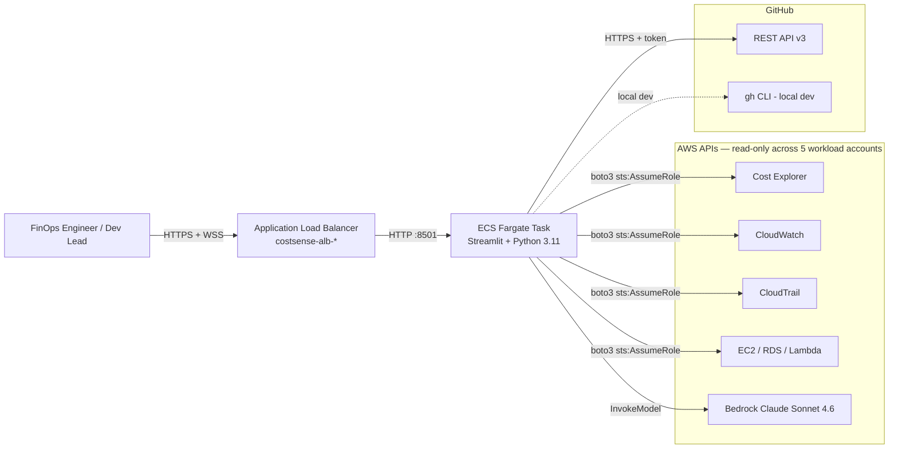
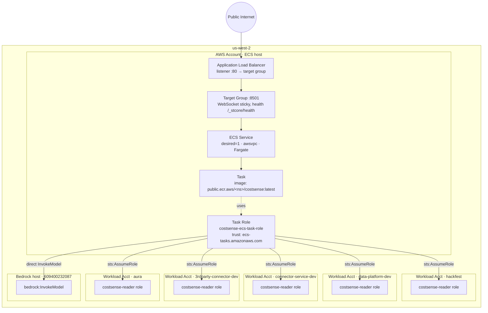
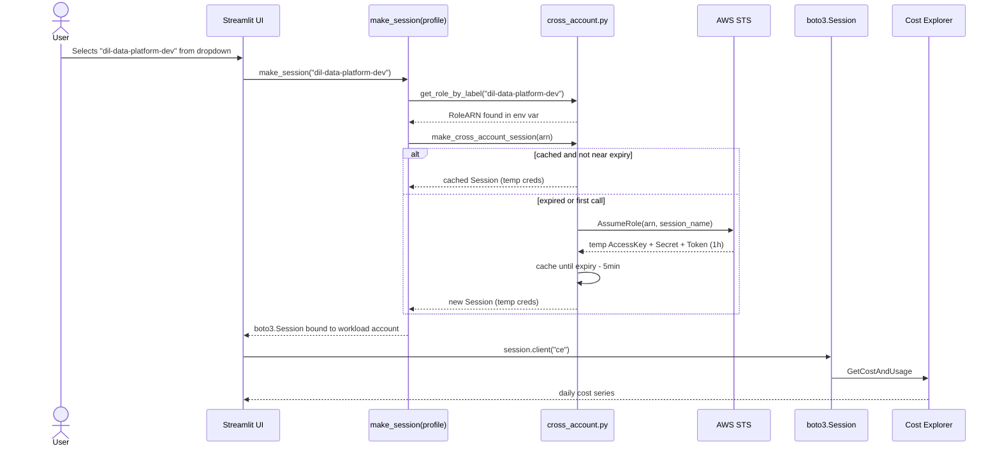
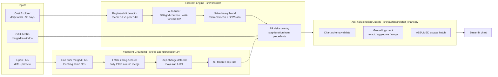
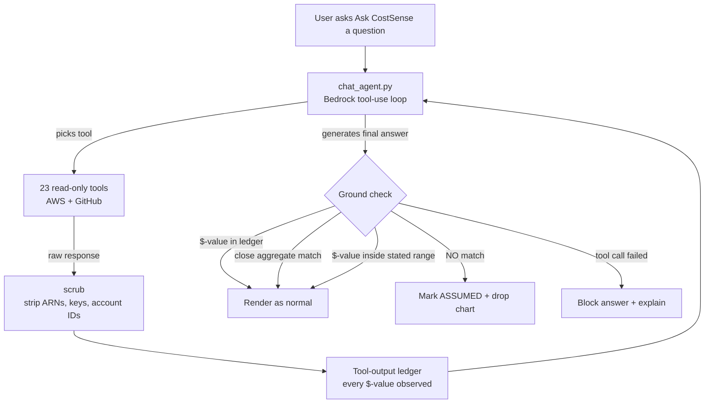
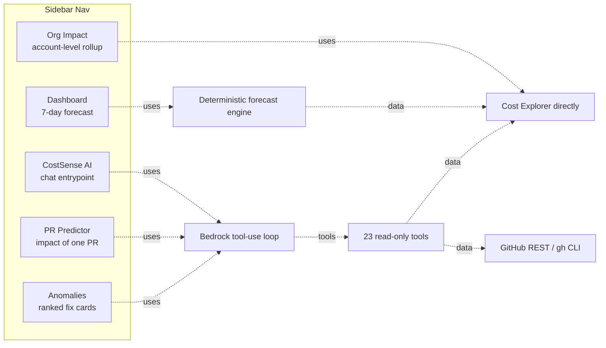

# CostSense — Design

*Submission design document for the Diligent Hackathon 2026 MCP for
Connected Compliance track. Diagrams are Mermaid — they render inline
on GitHub.*

- Live app: http://costsense-alb-257440129.us-west-2.elb.amazonaws.com
- Repo: https://github.com/asrithdili/Costsense-Forecast
- Architecture deep-dive: [ARCHITECTURE.md](ARCHITECTURE.md)
- AIPDLC log: [../AIPDLC.md](../AIPDLC.md)

---

## 1. The problem

Engineering teams inside Diligent ship code every day that changes AWS
spend. Existing tooling reports the damage *after* it hits Cost
Explorer — nothing ties **tomorrow's forecast** to **the PR that
merged yesterday**, and nothing produces a **grounded, explainable
recommendation** ("stop this NAT, save $217/mo") that a FinOps engineer
would trust.

CostSense fills that gap: it's an AI-native FinOps assistant that
combines live AWS billing data, real GitHub PR history, and Amazon
Bedrock Claude — with hard guardrails so no number in any answer is
ever hallucinated.

---

## 2. System context

**Key properties:**
- **Read-only everywhere.** No `create_*`, `delete_*`, `update_*` calls
  anywhere in the codebase.
- **5 workload accounts, one container.** ECS task role assumes into
  each linked account via `sts:AssumeRole`.
- **No long-lived AWS keys.** All credentials are short-lived STS
  session tokens; ECS task role is invoked via IMDS.
- **Every LLM output goes through a scrubber** (`src/ai_agent/aws_tools_broad.py::scrub`)
  before Claude sees it — no ARNs, keys, or account IDs leak out.

---

## 3. Deployed topology

**Why not CloudFormation:** the org SCP `p-uxu2m3ck` blocks
`iam:CreateRole` from CloudFormation in member accounts. All roles
created via console + CLI. Reproducible via
[`infra/deploy-public-ecr.sh`](../infra/deploy-public-ecr.sh) (ECR
push) + the manual steps documented in
[AIPDLC.md § 5.15](../AIPDLC.md).

**Why not App Runner:** App Runner's Envoy ingress rejects the
WebSocket upgrade required by Streamlit's `/_stcore/stream` endpoint in
this AWS org. ECS + ALB has no such restriction. The App Runner
attempt is preserved in `infra/README.md` for reference.

---

## 4. Cross-account request flow

The `profiles.py::resolve_all()` function makes cross-account roles
**first-class** — when `COSTSENSE_CROSS_ACCOUNT_ROLES` is set, local
SSO profiles are ignored entirely. This gives the deployed container
deterministic multi-account rendering from a single container
identity, without depending on any user's laptop.

---

## 5. Forecast + prediction pipeline

**Anti-hallucination guarantee:** the chart guard walks the *full tool
output* (not the 220-char UI preview) and rejects any $-figure Claude
emits that doesn't ground to a tool call. If a number can't be
grounded, the chart is dropped and the message shows an `ASSUMED`
qualifier so the user knows the model reached for a guess.

---

## 6. Anti-hallucination architecture

**Substitution guard:** if the user asks about account X but the
selected profile is Y, the guard rejects the answer instead of
silently substituting. Same for repo inference — the profile-to-repo
mapping is strict, no fuzzy fallback.

**Chart guard:** every prediction chart is validated against the
schema **and** grounded against the ledger. If a chart's y-values
don't reconcile with a tool output, the chart is stripped and the
message shows the `ASSUMED` badge.

---

## 7. Five pages, one design principle

**Design principle: every dollar figure traces back to a real API call.**
- Dashboard: dollars come from Cost Explorer directly. No LLM.
- Org Impact: same.
- PR Predictor / Anomalies / CostSense AI: LLM picks tools, tools hit
  real APIs, chart guard rejects any answer that can't be grounded.

---

## 8. Design decisions & trade-offs

| Decision | Reason | Trade-off accepted |
|---|---|---|
| **ECS + ALB, not App Runner** | Envoy in App Runner drops WebSocket. Streamlit can't render. | Manual scaling (single Fargate task), no built-in blue/green. |
| **Public ECR, not private** | Org SCP blocks `ecr:*` cross-account pull. | Docker image is public-readable; scrubbed of secrets by design. |
| **Cross-account role env var, not federated identity** | `iam:CreateUser` blocked by SCP; no OIDC provider set up for AWS in this org. | Env var must be manually rotated when workload roles change (~annual). |
| **Naive-heavy forecast blend, not Prophet** | Dev-account spend is level-shift dominated. Naive+regime beats Prophet by ~27pp WAPE. | Weak on strongly seasonal patterns; we don't have them. |
| **REST API fallback for GitHub, not just `gh` CLI** | Container doesn't ship `gh` CLI to keep image small. Silent fallback broke prediction grounding until fixed. | REST responses need `search/issues` normalization to `gh pr list` shape. |
| **On-import cache wipe, guarded by env flag** | Local dev needs clean state per run; container needs persistence across ALB request routing. | One env var (`COSTSENSE_PRESERVE_CACHE=1`) toggles the behavior. |
| **All 5 accounts read-only** | Zero blast radius; nothing can be broken by a bad LLM call. | Cannot execute recommendations from the app — user copies + runs manually or via GitHub draft PR. |

---

## 9. Security model

- **AWS credentials:** ECS task role → STS AssumeRole with 1-hour
  sessions. No long-lived keys. Session cached until `expiry - 5min`.
- **GitHub credentials:** classic PAT or fine-grained PAT with
  read-only repo scopes. Stored in ECS task-def env var (encrypted at
  rest by AWS Systems Manager Parameter Store if used).
- **Secrets in tool output:** every AWS API response passes through
  `scrub()` which strips ARNs, account IDs, session tokens, and
  access keys before it reaches Claude.
- **UI security:** XSRF disabled (safe — ALB doesn't set cookies for
  Streamlit sessions and there's no auth surface to CSRF against).
  CORS enabled to allow the WebSocket upgrade.
- **No PII, no customer data.** Only account-level billing +
  infrastructure metrics.

---

## 10. What we'd change with more time

- **OIDC-based ECS deploy** instead of manual `aws ecs update-service`.
  Requires an OIDC identity provider in the ECS host account.
- **CloudFormation for the ECS + ALB stack** once the org SCP is
  amended to allow `iam:CreateRole` from CFN.
- **Nightly forecast run.** `.github/workflows/daily.yml` exists as a
  scaffold. Adds one row to `data/forecasts/*.json` per day per
  account, enabling multi-week accuracy tracking.
- **Federated GitHub Actions → AWS role** so PRs can be scanned
  without a long-lived PAT.

---

## 11. Related docs

- [ARCHITECTURE.md](ARCHITECTURE.md) — implementation deep-dive
- [PAGES.md](PAGES.md) — feature-by-feature guide
- [DATA_FLOW.md](DATA_FLOW.md) — every data source + cache
- [WHY_COSTSENSE.md](WHY_COSTSENSE.md) — positioning + honest limits
- [../AIPDLC.md](../AIPDLC.md) — team development log
